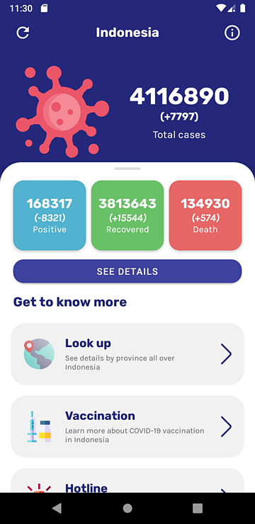
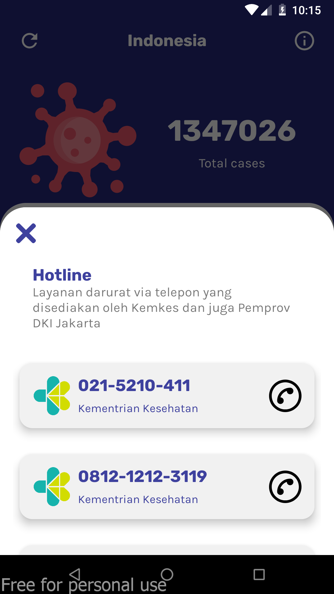
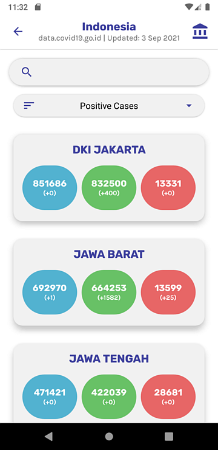
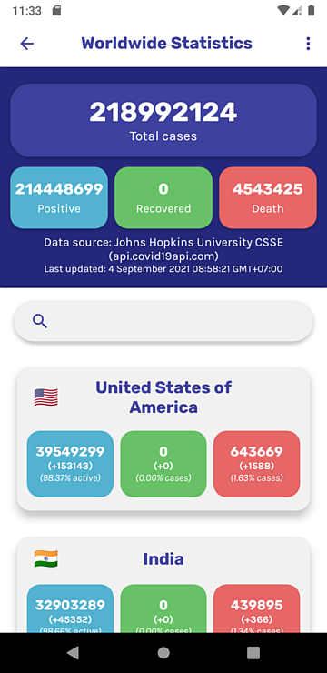
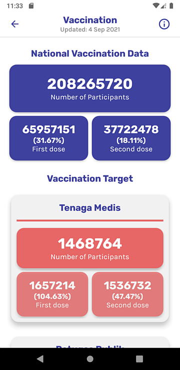
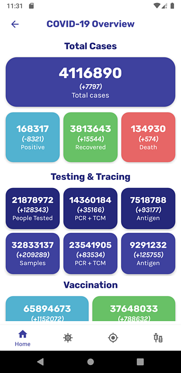
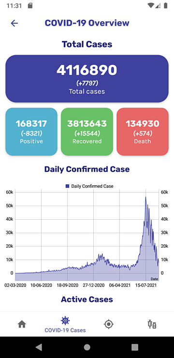
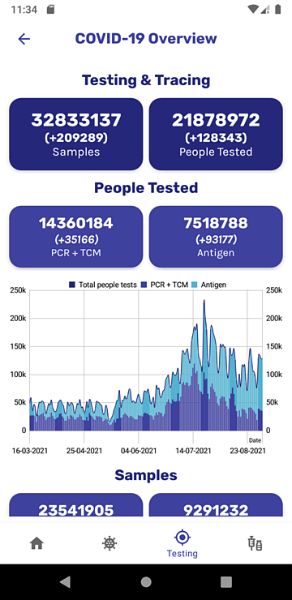
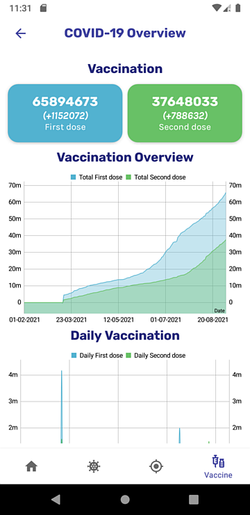

# BNCC Siaga COVID-19 (Jetpack Edition)

> For original project of **BNCC Siaga COVID-19**, see [akmalrusli363/BNCC-Academy-Kotlin-Demo](https://github.com/akmalrusli363/BNCC-Academy-Kotlin-Demo) for original project development, pure OkHttp and MVP architecture.

A repository for an app made during BNCC x Gojek Academy demonstrated using Kotlin, which shows data about COVID-19 statistics in Indonesia.

This repository is a **forked & Android Jetpack version** of [BNCC x Gojek Academy App: Siaga COVID19](https://github.com/akmalrusli363/BNCC-Academy-Kotlin-Demo) where the app was rebuilt under Android Jetpack in help to follow best practices, reduces boilerplate, clean and better maintainability of codes. This includes applied MVVM Architecture and usage of Retrofit, Moshi, and ReactiveX instead of plain OkHttp call and manual JSON parsing in parsing API network calls.

In forked/spin-off version of **BNCC Siaga COVID-19**, main API source are provided from `data.covid19.go.id` by default. Also, additional features from the app are published in this repository for advanced development of **Siaga COVID-19** app, especially for vaccination, testing, statistics, and more. 

> **INFO:** This branch/version contains **more statistical data** provided for COVID-19 statistics, especially for world data and additional COVID-19 statistics in Indonesia which contains more detailed data (rates in percentage, testing, and historical data) which divided into parts of experimental branches and may added or removed in that branch before applied into advanced version of Siaga COVID19 App.

## Parts & Features

### The Case Overview (Main screen)

This page contains Indonesia's statistical data about COVID-19 cases such as total cases, positive cases, recovered cases, and total cases (with additional daily case).

### Info/About Dialog

This feature will show information about the app version, sponsorships, and act of COVID-19 preventions in Indonesia.

### Hotline Dialog

")

This feature will show a list of phone number that you can reach out if you are experiencing a minor or major COVID-19 symptoms (e.g. fever, dry cough, tiredness, heavy breathes, etc). This feature implements MaterialUI BottomSheetDialogFragment to show a bottom sheet that appears from the bottom of the screen. This feature also lets the user quickly open the phone app to make a phone call to the chosen phone number.

### Region Lookup

This feature will show the number of coronavirus cases around Indonesia. You can search for your region for total cases, recovered cases, and death cases in your region (for example: DKI Jakarta, South Sulawesi, West Java, Bali, etc).

Additionally, you can sort for total cases, recovered cases, death cases, and their daily cases too.

### World Statistics (version 1.3.x or newer)

> Note: the data provider for world statistics (JHU CSSE) has not longer provide recovery count. See [CSSE COVID-19 data issue #4465](https://github.com/CSSEGISandData/COVID-19/issues/4465) for more detail.

This feature shows the number of coronavirus cases around the world. Each country has confirmed cases, active cases in percentage, recovery, and death cases (in counts and percentages). Not all data from the country may be accurate served because some countries may not served some data parts (such as recovery counts) due of data confidentiality in that country.

User can search countries using search box in world stat page and sort the country list based on country code, name, overall cases, or daily cases (e.g. confirmed, recovery, and deaths) from world stat menu.

### Vaccination (version 1.4.x or newer)

This feature shows COVID vaccination information which informs vaccination target, number of vaccinated persons (first dose/completed), vaccination progress, and vaccination group (with details & percentage of vaccinated persons in group).

Each vaccination group categorized in each color as follow:

- Medical group *(tenaga medis)*: red
- Public services *(tenaga publik)*: green
- Elders *(lansia)*: yellow
- General public/persons *(masyarakat umum/rentan)*: blue
- Teenagers *(kelompok usia 12-17 tahun/remaja)*: pink

### COVID-19 Testing & Vaccination (official data, version 1.4.x or newer)

This feature displays COVID-19 testing and vaccination data, alongside with COVID-19 case data summary. For COVID-19 testing & vaccination has data field as follow:

1. COVID-19 Testing:
  - PCR & Antigen samples
  - Person tested with PCR & Antigen test
  - Total samples & person tested
2. COVID-19 Vaccination (first dose and full-vaccinated)

The COVID-19 testing & vaccination can be accessed in **COVID-19 case details**.

### COVID-19 Case details (with history & chart, version 1.4.x or newer)

The COVID-19 case details feature divided in four section:

1. Summary: displays complete COVID-19 summary (including COVID-19 testing and vaccination).
2. COVID-19 case: displays COVID-19 case information & timeline history in chart.
3. Testing & tracing: displays COVID-19 testing & tracing information (samples/person tested) with timeline in chart.
4. Vaccination: displays COVID-19 vaccination information (first dose/full-vaccinated) with timeline in chart.

## The COVID-19 API URL
> Note: Data from BNPB has been deprecated. This dataset will be removed in future release, together with world statistics data source changes.

This application uses COVID-19 data API supplied from [data.covid19.go.id](https://data.covid19.go.id) which fetches data for Case Overview and Regional Lookup features. For emergency call and phone number for regional emergency services, we uses BNCC Corona's Firebase API Services provided at [bncc-corona-versus.firebaseio.com/v1/hotlines.json](https://bncc-corona-versus.firebaseio.com/v1/hotlines.json).

Summarily, the list of API we've provided for this app:

| Feature | Data APIs URL | Data Provider | Branch |
| --- | --- | :---: | :---: |
| National Data Overview | https://data.covid19.go.id/public/api/update.json | [Satgas COVID-19](https://data.covid19.go.id/public/index.html) | any |
| Regional Data Overview | https://data.covid19.go.id/public/api/prov.json | [Satgas COVID-19](https://data.covid19.go.id/public/index.html) | any |
|  | ~~https://api.kawalcorona.com/indonesia/provinsi~~ | ~~[BNPB Indonesia](https://bnpb-inacovid19.hub.arcgis.com/)~~ | ~~`develop`~~ |
| Hotline | https://bncc-corona-versus.firebaseio.com/v1/hotlines.json | ? | any |
| World Statistics (summary + countries) | https://api.covid19api.com/summary | [Johns Hopkins University CSSE](https://coronavirus.jhu.edu/map.html) | `develop` |
| Testing & Vaccination | https://data.covid19.go.id/public/api/pemeriksaan-vaksinasi.json | [Satgas COVID-19](https://data.covid19.go.id/public/index.html) | `develop-1.4` |
| Vaccination Overview | https://cekdiri.id/vaksinasi | [Kementerian Kesehatan](https://vaksin.kemkes.go.id/) | `develop-1.4` |

## Changelog

### 1.4.x
Added COVID-19 Testing & Vaccination (provided from Satgas COVID-19 & Kemenkes).
- **1.4.1** : Removed BNPB data sources.

### 1.3.x
- **1.3.1** : Migrated to Jetpack version (from MVP to MVVM, OkHttp to Retrofit + RxJava) for `develop` branch.
- Added world case overview.
- ~~Supports [api.kawalcorona.com](https://api.kawalcorona.com/) as COVID-19 region lookup data source (provided from BNPB Indonesia)~~ **_(removed in 1.3.2)_**

### 1.2.x
Changed and migrated to Jetpack version (from MVP to MVVM, OkHttp to Retrofit + RxJava).

### 1.1.x
Use [data.covid19.go.id](https://data.covid19.go.id) as main COVID-19 data source.
- Introduced sorting in region lookup.
  
### 1.0.x
Initial release (fresh from BNCC x Gojek Academy application demonstration).
- Uses [api.kawalcorona.com](https://api.kawalcorona.com/) as main COVID-19 data source.

## Image/Asset Credits

The project concepts/mockups:
- https://www.figma.com/file/rQSHbma7q4eOt0tJKSTQfX/bncc-covid

Image/asset related URL's:
1. Virus (app icon): https://www.flaticon.com/free-icon/virus_3096565
2. Shield (in app icon): https://www.flaticon.com/free-icon/shield_786346
3. Virus (in overview): https://www.flaticon.com/free-icon/virus_2659980
4. Location pin: https://www.flaticon.com/free-icon/location-pin_3203087
5. Siren: https://www.flaticon.com/free-icon/siren_3127087
6. Chevron icon: https://www.flaticon.com/free-icon/chevron_748073
7. Rubik & Karla font: https://fontpair.co/downloads/Rubik%20and%20Karla.zip
8. Phone call icon: https://www.flaticon.com/free-icon/phone-call_2122018
9. Close icon: https://www.flaticon.com/free-icon/close_1828774
10. Arrow icon: https://www.flaticon.com/free-icon/arrow_507257
11. Globe icon: https://www.flaticon.com/free-icon/global_3190466
12. Vaccine icon: https://www.flaticon.com/free-icon/vaccine_4490652
