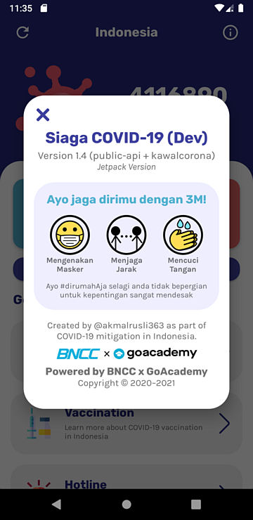

# BNCC-Academy-Kotlin-Demo

A repository for an app made during BNCC x Gojek Academy demonstrated using Kotlin, which shows data about COVID-19 statistics in Indonesia

> **INFO:** This branch is **different** from `master` branch because this branch serves data from [data.covid19.go.id](https://data.covid19.go.id) in which serves daily cases for national and regional cases, and served officially from government supported (Satgas COVID-19) committee.

## Parts & Features

### The Case Overview (Main screen)

This page contains Indonesia's statistical data about COVID-19 cases such as total cases, positive cases, recovered cases, and total cases (with additional daily case supplied at branch [`dev/public_api`](https://github.com/akmalrusli363/BNCC-Academy-Kotlin-Demo/tree/dev/public_api)).

### Info/About Dialog

This feature will show information about the app version, sponsorships, and act of COVID-19 preventions in Indonesia.

### Hotline Dialog

")

This feature will show a list of phone number that you can reach out if you are experiencing a minor or major COVID-19 symptoms (e.g. fever, dry cough, tiredness, heavy breathes, etc). This feature implements MaterialUI BottomSheetDialogFragment to show a bottom sheet that appears from the bottom of the screen. This feature also lets the user quickly open the phone app to make a phone call to the chosen phone number.

### Lookup Feature

This feature will show the number of coronavirus cases around Indonesia. You can search for your region for total cases, recovered cases, and death cases in your region (for example: DKI Jakarta, South Sulawesi, West Java, Bali, etc).

In [`dev/public_api-sorting`](https://github.com/akmalrusli363/BNCC-Academy-Kotlin-Demo/tree/dev/public_api-sorting), you can sort for total cases, recovered cases, death cases, and their daily cases too. 

## The COVID-19 API URL
This application uses COVID-19 data API supplied from [data.covid19.go.id](https://data.covid19.go.id) which fetches data for Case Overview and Regional Lookup features. For emergency call and phone number for regional emergency services, we uses BNCC Corona's Firebase API Services provided at [bncc-corona-versus.firebaseio.com/v1/hotlines.json](https://bncc-corona-versus.firebaseio.com/v1/hotlines.json).

Summarily, the list of API we've provided for this app:

| Feature | Data APIs URL | Branch |
| --- | --- | :---: |
| National Data Overview | https://api.kawalcorona.com/indonesia/ | `master` |
|  | https://data.covid19.go.id/public/api/update.json | `dev/public_api` |
| Regional Data Overview | https://api.kawalcorona.com/indonesia/provinsi | `master` |
|  | https://data.covid19.go.id/public/api/prov.json | `dev/public_api` |
| Hotline | https://bncc-corona-versus.firebaseio.com/v1/hotlines.json | any |

## Image/Asset Credits

The project concepts/mockups:
- https://www.figma.com/file/rQSHbma7q4eOt0tJKSTQfX/bncc-covid

Image/asset related URL's:
1. Virus (app icon): https://www.flaticon.com/free-icon/virus_3096565
2. Shield (in app icon): https://www.flaticon.com/free-icon/shield_786346
3. Virus (in overview): https://www.flaticon.com/free-icon/virus_2659980
4. Location pin: https://www.flaticon.com/free-icon/location-pin_3203087
5. Siren: https://www.flaticon.com/free-icon/siren_3127087
6. Chevron icon: https://www.flaticon.com/free-icon/chevron_748073
7. Rubik & Karla font: https://fontpair.co/downloads/Rubik%20and%20Karla.zip
8. Phone call icon: https://www.flaticon.com/free-icon/phone-call_2122018
9. Close icon: https://www.flaticon.com/free-icon/close_1828774
10. Arrow icon: https://www.flaticon.com/free-icon/arrow_507257
