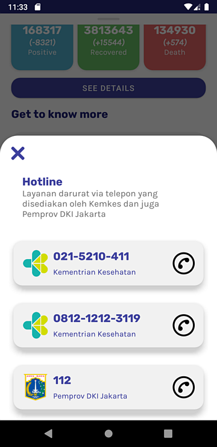

# BNCC Siaga COVID-19 (Jetpack Edition)

> For original project of **BNCC Siaga COVID-19**, see [akmalrusli363/BNCC-Academy-Kotlin-Demo](https://github.com/akmalrusli363/BNCC-Academy-Kotlin-Demo) for original project development, pure OkHttp and MVP architecture.

> [!NOTE]
> This project has been **archived** due to most COVID-19 API services/data sources are not longer available.
>
> Also, this project is now an Android project to demonstrate statistical data for portfolio purpose, whlist the data sources is not longer available for now.

A repository for an app made during BNCC x Gojek Academy demonstrated using Kotlin, which shows data about COVID-19 statistics in Indonesia.

This repository is a **forked & Android Jetpack version** of [BNCC x Gojek Academy App: Siaga COVID19](https://github.com/akmalrusli363/BNCC-Academy-Kotlin-Demo) where the app was rebuilt under Android Jetpack in help to follow best practices, reduces boilerplate, clean and better maintainability of codes. This includes applied MVVM Architecture and usage of Retrofit, Moshi, and ReactiveX instead of plain OkHttp call and manual JSON parsing in parsing API network calls.

In forked/spin-off version of **BNCC Siaga COVID-19**, main API source are provided from `data.covid19.go.id` by default. Also, additional features from the app are published in this repository for advanced development of **Siaga COVID-19** app, especially for vaccination, testing, statistics, and more. 

## Parts & Features

### The Case Overview (Main screen)

This page contains Indonesia's statistical data about COVID-19 cases such as total cases, positive cases, recovered cases, and total cases (with additional daily case supplied at branch [`dev/public_api`](https://github.com/akmalrusli363/BNCC-Academy-Kotlin-Demo/tree/dev/public_api)).

### Info/About Dialog

This feature will show information about the app version, sponsorships, and act of COVID-19 preventions in Indonesia.

### Hotline Dialog

")

This feature will show a list of phone number that you can reach out if you are experiencing a minor or major COVID-19 symptoms (e.g. fever, dry cough, tiredness, heavy breathes, etc). This feature implements MaterialUI BottomSheetDialogFragment to show a bottom sheet that appears from the bottom of the screen. This feature also lets the user quickly open the phone app to make a phone call to the chosen phone number.

### Lookup Feature

This feature will show the number of coronavirus cases around Indonesia. You can search for your region for total cases, recovered cases, and death cases in your region (for example: DKI Jakarta, South Sulawesi, West Java, Bali, etc).

In [`dev/public_api-sorting`](https://github.com/akmalrusli363/BNCC-Academy-Kotlin-Demo/tree/dev/public_api-sorting), you can sort for total cases, recovered cases, death cases, and their daily cases too.

## The COVID-19 API URL

> [!NOTE]
> The COVID-19 API URLs are not longer available.

This application uses COVID-19 data API supplied from [data.covid19.go.id](https://data.covid19.go.id) which fetches data for Case Overview and Regional Lookup features. For emergency call and phone number for regional emergency services, we uses BNCC Corona's Firebase API Services provided at [bncc-corona-versus.firebaseio.com/v1/hotlines.json](https://bncc-corona-versus.firebaseio.com/v1/hotlines.json).

Summarily, the list of API we've provided for this app:

| Feature                | Data APIs URL                                                  |                          Data Provider                          |  Branch   |
|------------------------|----------------------------------------------------------------|:---------------------------------------------------------------:|:---------:|
| National Data Overview | ~~https://data.covid19.go.id/public/api/update.json~~          | [Satgas COVID-19](https://data.covid19.go.id/public/index.html) |    any    |
| Regional Data Overview | ~~https://data.covid19.go.id/public/api/prov.json~~            | [Satgas COVID-19](https://data.covid19.go.id/public/index.html) |    any    |
|                        | ~~https://api.kawalcorona.com/indonesia/provinsi~~             |    [BNPB Indonesia](https://bnpb-inacovid19.hub.arcgis.com/)    | `develop` |
| Hotline                | ~~https://bncc-corona-versus.firebaseio.com/v1/hotlines.json~~ |                                ?                                |    any    |

## Changelog

> For newer version, see `develop` branch or visit each representative version on `version/x.x` branch.

### 1.2.x
Changed and migrated to Jetpack version (from MVP to MVVM, OkHttp to Retrofit + RxJava).

### 1.1.x
Use [data.covid19.go.id](https://data.covid19.go.id) as main COVID-19 data source.
- Introduced sorting in region lookup.
  
### 1.0.x
Initial release (fresh from BNCC x Gojek Academy application demonstration).
- Uses [api.kawalcorona.com](https://api.kawalcorona.com/) as main COVID-19 data source.

## Image/Asset Credits

The project concepts/mockups:
- https://www.figma.com/file/rQSHbma7q4eOt0tJKSTQfX/bncc-covid

Image/asset related URL's:
1. Virus (app icon): https://www.flaticon.com/free-icon/virus_3096565
2. Shield (in app icon): https://www.flaticon.com/free-icon/shield_786346
3. Virus (in overview): https://www.flaticon.com/free-icon/virus_2659980
4. Location pin: https://www.flaticon.com/free-icon/location-pin_3203087
5. Siren: https://www.flaticon.com/free-icon/siren_3127087
6. Chevron icon: https://www.flaticon.com/free-icon/chevron_748073
7. Rubik & Karla font: https://fontpair.co/downloads/Rubik%20and%20Karla.zip
8. Phone call icon: https://www.flaticon.com/free-icon/phone-call_2122018
9. Close icon: https://www.flaticon.com/free-icon/close_1828774
10. Arrow icon: https://www.flaticon.com/free-icon/arrow_507257
